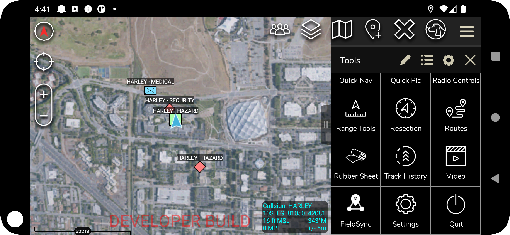
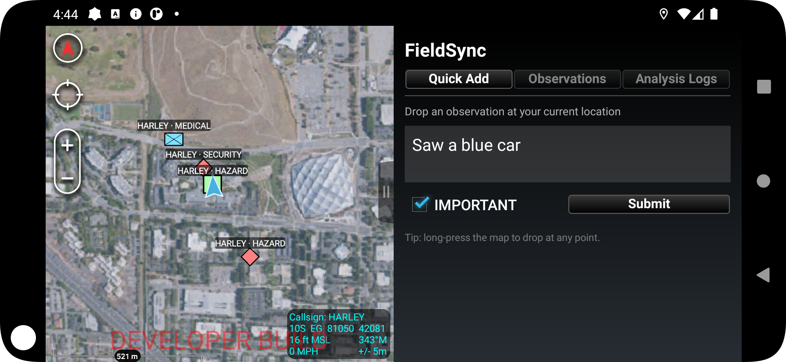
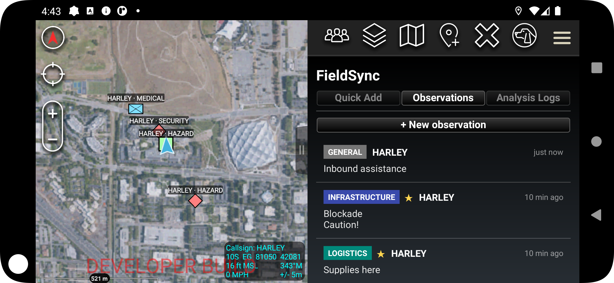
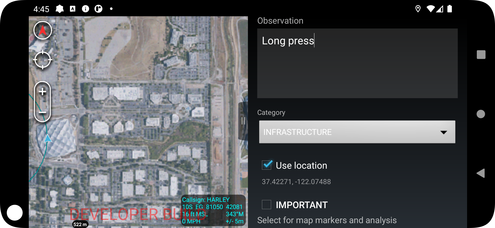

# FieldSync

FieldSync is a ATAK CIV 5.6.0 plugin for shared field observations with peer-to-peer sync via [Ditto](https://ditto.live/). Operators can capture categorized notes with optional map locations, review them in a shared log, and visualize location-based reports on the ATAK map.

FieldSync Civ plugin was created with the intent of learning about Ditto and ATAK development!

This repository is source-available for portfolio/technical review.

---

## Demo Video

[FieldSync walkthrough (Google Drive)](https://drive.google.com/file/d/1phMeQ_8mdgiFigLgN-_QNISFvtoOHhF3/view?usp=sharing)

Demo shows core workflow: opening FieldSync in ATAK, creating detailed or short observations, marking priority entries, browsing the log, and viewing map markers.

(Disclaimer: Video was edited via AI software)

---

## Screenshots

### Map markers and plugin icon

Observations appear as category-colored markers on the ATAK map. Open FieldSync from the Tools menu using the mesh icon.



### Quick Add

Drop a short observation at your current location and mark important entries for priority visibility.



### Observation log

Browse synced observations by category, callsign, and time. Tap **+ New observation** for the full form.



### Detailed observation form

Create or edit an observation with free text, category, optional GPS coordinates, and an important flag.



---

## Purpose and Capabilities

FieldSync gives field teams a lightweight shared notebook inside ATAK:

1. **Capture** — Quick-add or full-form observations with categories such as Hazard, Infrastructure, Logistics, Medical, Security, and General.
2. **Sync** — Replicate observations peer-to-peer over Wi-Fi / BLE through Ditto.
3. **Visualize** — Display location-linked observations as category-styled ATAK map markers.
4. **Analyze** — (Future plan) View AI-generated summaries when an external AI node is available on the mesh.

FieldSync captures, syncs, and displays field notes. It does not autonomously create routes, missions, or CoT events from AI output.

---

## Status

In development (`v0.1`). Compatible with ATAK CIV 5.6.0.

---

## Technology Stack

| Layer    | Technology                                                    |
| -------- | ------------------------------------------------------------- |
| Host     | ATAK CIV 5.6.0                                                |
| Language | Java 17 + Kotlin bridge (`DittoHelper.kt`)                    |
| Build    | Gradle 8.x + `atak-gradle-takdev.jar`                         |
| Sync     | Ditto Android SDK v5 (`com.ditto:ditto-kotlin-android:5.0.0`) |
| Android  | API 24+                                                       |

---

## Compilation

**Prerequisites**

* ATAK CIV 5.6.0 SDK at `D:\Development\ATAK\ATAK-CIV-5.6.0-SDK\`
* JDK 17 using the Gradle JDK in Android Studio
* Kotlin Gradle plugin **2.2.0** for ATAK SDK compatibility
* `local.properties` configured from `template.local.properties`
* `.env` file at the repository root with Ditto credentials

**Build**

Building and installing the APK can be done using Android Studio Emulator drag and drop. Optionally you can use powershell. 

```powershell
cd D:\Development\ATAK\ATAK-CIV-5.6.0-SDK\samples\fieldsync
.\gradlew assembleCivDebug
```

Output:

```powershell
app\build\outputs\apk\civ\debug\ATAK-Plugin-fieldsync-*.apk
```

**Install on emulator / device**

```powershell
adb -s emulator-5554 install -r app\build\outputs\apk\civ\debug\*.apk
adb -s emulator-5554 shell am force-stop com.atakmap.app.civ
adb -s emulator-5554 shell monkey -p com.atakmap.app.civ -c android.intent.category.LAUNCHER 1
```

**Ditto credentials** (`.env`, not committed):

```env
DITTO_APP_ID=your-app-id
DITTO_PLAYGROUND_TOKEN=your-token
DITTO_AUTH_URL=https://your-app.cloud.ditto.live
```

---

## Point of Contact

Robert Sima — [robertsima88@gmail.com](mailto:robertsima88@gmail.com)

---

## License

Copyright © 2026 Robert Sima. All rights reserved.

This repository is provided for portfolio review, technical evaluation, and discussion. The code, documentation, and project assets may be viewed to understand the design and implementation, but reuse, redistribution, modification, or incorporation into other projects requires prior written permission.

Third-party dependencies, including the ATAK SDK and Ditto SDK, remain governed by their respective licenses.
